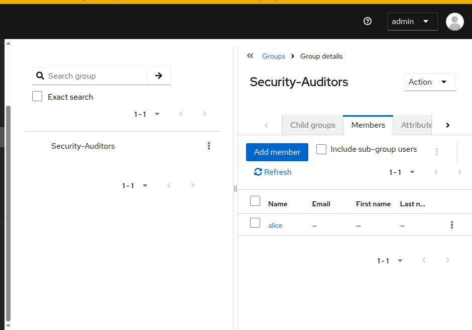
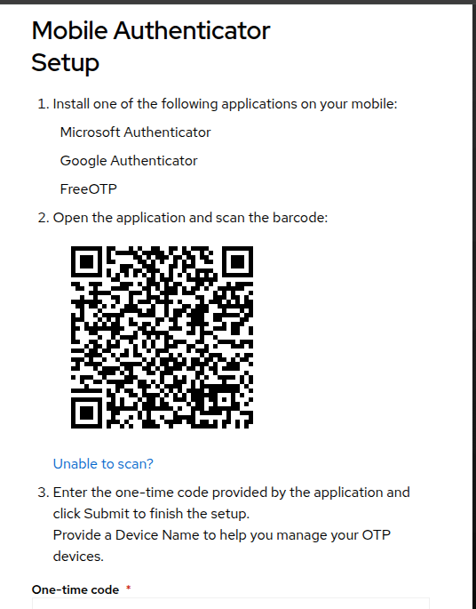

# Local Identity & Access Management (IAM) Sandbox

An enterprise-grade, local security laboratory built to demonstrate the configuration, deployment, and auditing of robust Identity and Access Management principles. This project showcases the practical implementation of central authentication, multi-factor authentication enforcement, and granular Role-Based Access Control (RBAC).

## 🛠️ Infrastructure Stack
* **Host Platform:** macOS Environment
* **Hypervisor:** VirtualBox Linux VM Guest
* **Orchestration:** Docker Containerization Engine
* **Identity Provider:** Keycloak (Enterprise Identity and Access Management Solution)

---

## 🔒 Security Architectures Implemented

### 1. Robust Cryptographic Password Policies
Configured strict password complexity constraints at the realm layer to prevent brute-force and credential-stuffing vectors:
* Minimum character length threshold established at 12 characters.
* Mandatory injection of mixed-case characters, numerical integers, and unique alphanumeric symbols.

### 2. Role-Based Access Control (RBAC) & Least Privilege
Engineered a compartmentalized user directory to enforce the principle of least privilege:
* Created dedicated administrative and non-administrative user objects.
* Provisioned an **Audit Team** security group mapped with isolated, read-only dashboard permissions.
* Validated that group-level authorization inheritance dynamically restricts regular users from introducing unauthorized global configuration changes.

### 3. Multi-Factor Authentication (MFA) Enforcement
Hardened the tenant authentication pipeline by deploying mandatory Time-Based One-Time Password (TOTP) validation workflows:
* Forced an explicit conditional authentication step requiring real-time registration of individual authenticator applications.
* Successfully resolved network and loopback integration issues to render stable client enrollment endpoints.

---

## 📸 Lab Verification & Evidence

### User Directory & Group Mapping
Below is the verification of the user directory profile showing inherited group permissions and the assigned read-only compliance attributes.



### 2FA Enrollment Challenge Intercept
Below is the mandatory security checkpoint generated dynamically when an authorized identity accesses the portal prior to binding an active authenticator device.



---

## ⚙️ How to Deploy the Environment
To spin up the isolated development identity provider instance container locally, execute:

```bash
sudo docker run -d --name my-iam-sandbox -p 8080:8080 -e KEYCLOAK_ADMIN=admin -e KEYCLOAK_ADMIN_PASSWORD=your_secure_password quay.io/keycloak/keycloak:latest start-dev
